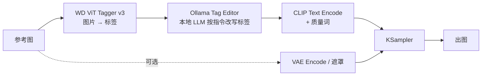

# ComfyUI Ollama Tag Editor · 本地多模型生成流水线

把 **图像打标模型（WD Tagger）+ 本地 LLM（Ollama）+ 扩散模型（SDXL / Animagine / NoobAI）** 串成一条可复用的出图流水线：
用一句话描述你想改什么，让本地大模型去改写图片标签，再交给绘图模型生成。

本项目包含一个自研 ComfyUI 自定义节点（纯 Python 标准库，无第三方依赖）和一整套可直接导入的工作流 JSON。

> 个人实验项目，在 Windows + RTX 4060 Laptop（8GB 显存）单机验证。**不包含任何模型权重**。

---

## ✨ 特性

### 节点：`Ollama Tag Editor`

| 能力 | 说明 |
|---|---|
| 打通 LLM → 扩散模型条件链路 | 输出单个 `STRING`，直接接 `CLIP Text Encode` |
| 模型列表自动发现 | 读取 `{base_url}/api/tags`，带 60s 缓存与离线兜底候选 |
| 统一关闭思维链 | 请求体固定携带 `think: false`（Qwen3 / Nanbeige 等模板默认会思考，不关会导致正文为空） |
| 复读治理 | `repeat_penalty` / `repeat_last_n` / 停止序列 + 输出去重 + 长度上限 |
| 可靠性 | 请求超时、异常输出自动重试一次、参数类型容错（错位/脏值不会中断工作流） |
| 质量词注入 | 自动追加 `masterpiece, best quality, ...`（Illustrious / NoobAI 系必需），并剔除重复质量词 |
| 可观测 | 每次调用打印指令、原标签、模型原始返回、最终标签到后端控制台 |

### 工作流模板

| 文件 | 用途 | 关键机制 |
|---|---|---|
| `animagine_xl4_tagedit_txt2img.json` | 参考图 → 打标 → LLM 改写 → **空白画布重绘** | 只借标签、不复用像素，构图全新 |
| `animagine_xl4_tagedit_img2img.json` | 参考图 → 打标 → LLM 改写 → **图生图** | 保留结构，按指令改内容 |
| `animagine_xl4_inpaint_outfit.json` | **遮罩局部重绘**（如只换衣服） | `VAEEncodeForInpaint` + `SetLatentNoiseMask`，遮罩外像素级保留 |
| `AB_pipeline_animagine_vs_noobai.json` | **双模型 A/B 对比** | 共享底噪、同随机种子、同一串 LLM 改写标签，单次运行出两张可比图 |
| `animagine_xl4_neuralbooru_txt2img.json` | 用第三方 NeuralBooru 节点做"自然语言 → booru 标签" | 可选依赖 |

---

## 🧭 数据流



三类可组合的"结构控制"：**空白画布（全自由）/ 图生图（保结构）/ 遮罩（精确局部）**，
内容控制统一交给"打标 + LLM 改写标签"这一段——需求变化时通常只需改一句 instruction。

---

## 📦 安装

### 1. 安装节点

```bash
cd ComfyUI/custom_nodes
git clone https://github.com/hubberfr/comfyui-ollama-tag-editor
# 把 custom_nodes/ComfyUIOllamaTagEditor 目录复制到你的 ComfyUI/custom_nodes/ 下
```

> 节点零第三方依赖，用的是 Python 标准库（`urllib` / `json` / `re`），不需要 `pip install`。
> 复制后**重启 ComfyUI**。

### 2. 准备本地 LLM（Ollama）

```bash
ollama pull qwen2.5:7b          # 官方 instruct，结构化输出稳定
# 或自带 GGUF：ollama create <名称> -f Modelfile
```

节点会在 `{base_url}/api/tags` 自动列出你已安装的模型；新增模型后右键节点 → 刷新节点定义即可看到。

### 3. 准备打标模型（可选，不使用打标链路时忽略）

把 WD ViT Tagger v3 的三件套放进 `ComfyUI/models/wd_taggers/<模型名>/`：

```
config.json          # timm 架构配置
model.safetensors    # 权重（约 360MB）
selected_tags.csv    # 10861 个标签
```

### 4. 准备绘图模型

- `ComfyUI/models/checkpoints/`：`animagine-xl-4.0-opt.safetensors`、`NoobAI-XL-Vpred-v1.0.safetensors`（或替换为你自己的 SDXL 系模型，并在工作流里改下拉框）

---

## 🚀 快速开始

1. 重启 ComfyUI → 菜单「工作流」→ 打开 `animagine_xl4_tagedit_txt2img`；
2. 把参考图拖进 `Load Image`（它**只用于打标**）；
3. 在 `Ollama Tag Editor` 节点里写一句你想要的改动，例如：`把服装改成黑色连衣裙，其余保持不变`；
4. 运行。控制台会打印最终标签，出图保存在 `ComfyUI/output/`。

> 部分工作流加载后需要重新选择模型下拉框（因为文件名取决于你本地的模型）。

---

## 🧪 关键排障记录（本项目含金量最高的部分）

详见 [`docs/troubleshooting.md`](docs/troubleshooting.md)，四个真实故障的定位过程与修复原理：

| 现象 | 定位手段 | 根因 | 修复 |
|---|---|---|---|
| 画面颜色异常鲜艳、画风诡异，调 CFG 无效 | 读取 `.safetensors` 头部 `__metadata__` | v-pred 模型缺 `prediction_type` 标记 → 被按 eps 采样 | `ModelSamplingDiscrete(sampling=v_prediction)` |
| 换模型后输出突然"发冲"、质量下降 | 同一工作流 A/B 分支隔离变量 | 提示词缺质量词（Illustrious / NoobAI 系敏感） | 节点自动注入质量词后缀 |
| 输出里同一标签重复 200+ 次直到截断 | 打印模型原始返回 + `done_reason=length` | 小模型采样退化 + token 预算耗尽 | 重复惩罚 + 停止序列 + 去重 + 超时重试 |
| 参数值错位、报"无法转换类型" | 对照节点控件顺序与工作流存档 | ComfyUI 控件值按位置存储，新参数插入中间导致错位 | 新参数一律追加到末尾 + 类型容错 |

模型与量化选型（含 8GB 显存取舍）见 [`docs/models-and-quantization.md`](docs/models-and-quantization.md)。

---

## ⚠️ 已知限制

- 仅在本机单卡环境验证，未做并发/服务化压测；
- 打标器对**非标准色（异色皮肤等）与色序（RGB/BGR）敏感**，不同权重来源可能需要调整预处理标记；
- LLM 输出的稳定性强依赖模型本身：**官方 instruct 模型 > 去除审查的社区微调**；节点只能兜底，不能根治；
- 8GB 显存下"绘图模型 + LLM"会互相挤占，建议设置 `OLLAMA_KEEP_ALIVE` 让 LLM 用后即卸载；
- v-pred 模型只能用 Euler / DDIM（不能用 Karras 系调度器）。

## 🙏 致谢

ComfyUI、Ollama、llama.cpp、SmilingWolf（WD Tagger 系列）、timm、Cagliostro Lab（Animagine XL）、Laxhar（NoobAI-XL）、
以及 [ComfyUI-WD-Timm-Tagger](https://github.com/bedovyy/ComfyUI-WD-Timm-Tagger)、[NeuralBooru](https://github.com/ChrisJohnson89/ComfyUI-NeuralBooru) 等开源节点作者。

## 📄 License

代码以 [MIT](LICENSE) 开源。**模型权重与标签数据不在本仓库内**，其许可与使用条款以各自模型主页为准。

## 免责声明

本项目仅用于技术学习与本地实验。使用者需自行确保生成内容符合当地法律法规与目标平台政策。
